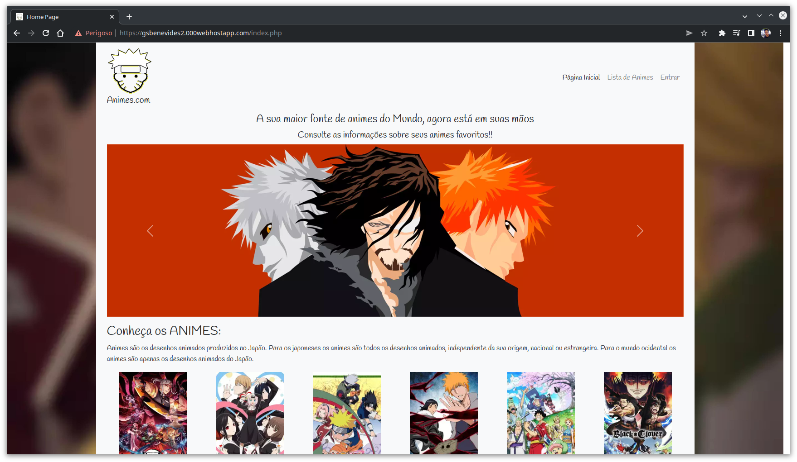

<h1 align="center">Animes.com</h1>

Um site de cadastro de informações sobre animes.
Resultado do trabalho em grupo para a disciplina de Eletiva PHP do curso de Análise e Desenvolvimento de Sistemas da <a target=" _blank" href="https://www.fatecmogidascruzes.com.br/">Fatec Mogi das Cruzes</a>.

<a target="_blank" href="https://gsbenevides2.000webhostapp.com/index.php">
    </img>
    
 Veja ele ao-vivo no webhost.🛰

</a>

<h2>⚙️ Funcionalidades</h2>
<ul>
<li>Cadastro de Usuário</li>
<li>Cadastro de Animes</li>
<li>Edição de Animes</li>
<li>Exclusão de Animes</li>
<li>Busca de Animes</li>
</ul>

<h2>📚 Tecnologias</h2>
<ul>
<li><b>PHP:</b> Linguagem de programação utilizada para o desenvolvimento do site.</li>
<li><b>MySQL:</b> Banco de dados utilizado para armazenar as informações.</li>
<li><b>Bootstrap:</b> Framework utilizado para o desenvolvimento do front-end.</li>
</ul>

<h2>👨🏾🧑🏻👨🏻Integrantes do Grupo</h2>
<ul>
<li><a target="_target" href="https://github.com/OneCoke">Felipe dos Santos</a></li>
<li><a target="_target" href="https://github.com/gsbenevides2">Guilherme da Silva Benevides</a></li>
<li><a target="_target" href="https://github.com/LucasHenriqueSZ">Lucas Henrique de Souza</a></li>
 Com apoio e orientação da Professora Especialista <a target="_blank" href="https://lattes.cnpq.br/4523411334737038">Mariângela Ferreira Fuentes Molina</a>.
</ul>

<h2>📃 Licença</h2>

Este projeto está sobre a licença MIT. Veja ela em: <a href="LICENSE">LICENSE</a>.

Feito com 🤍 por nós.

